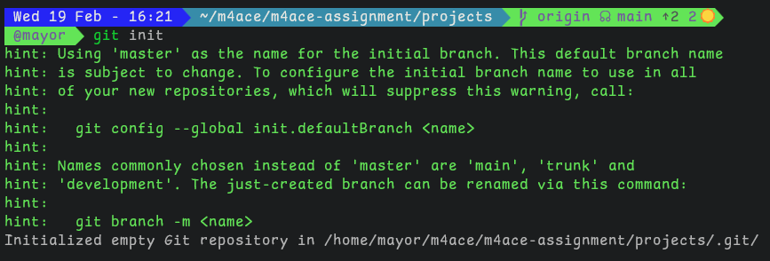
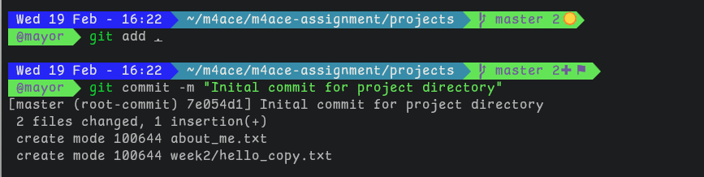
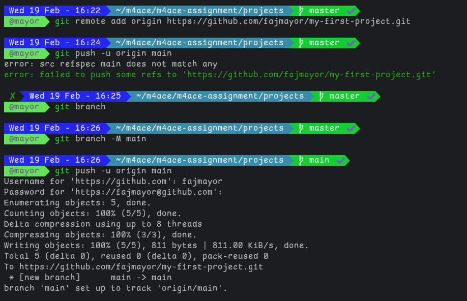
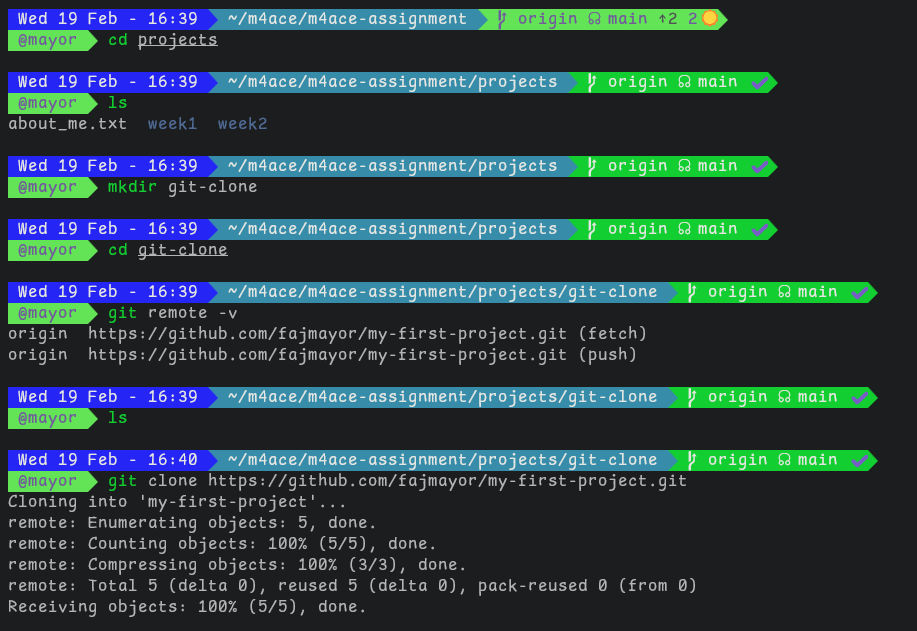
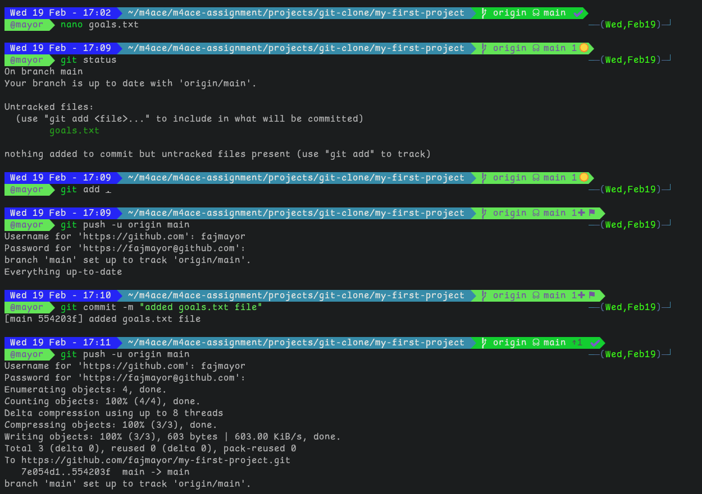

# m4ace project on Git and GitHub Basics

## Description of the Git commands used and their outputs

1. ### Initialize Git Repository (git init)

- `git init` command was used to initialized git in the **projects** folder from week1

2. ### Add and Commit files

- `git add .` command was used to add all the git tracking files and directories in the project directory to git staging area

- `git commit -m "initial commit"` command was used to snapshot the files and directories in the staging area to git local repository

3. ### Push to GitHubs

- `git add remote origin url` command was used to add the remote GitHub url to the local repository for data synchronization.

- `git push -u origin` command was used pushed all the local repository data to the remote repository for tracking and collaboration.

3. ### Cloning

- `git clone url` command was used to clone all the data in the remote repository to **git-clone** directory on the local

3. ### Modify and Push

- **goals.txt** file was created using `code goals.txt` and typed my Cloud Engineering program goals.

- `git add goals.txt` was used to add the file to the staging area

- `git status` command was used to check if the file has been moved to the staging area

- `git commit -m "added goals.txt file"` command was used to add the file to the local repository

- `git push -u origin` command was used to move the local repository file to the remote repository on GitHub